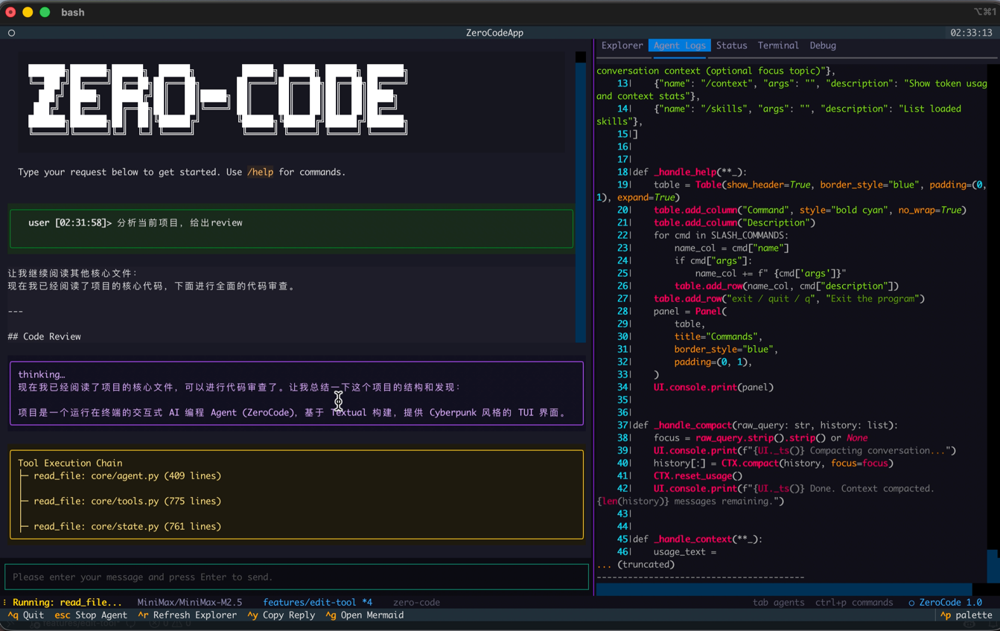
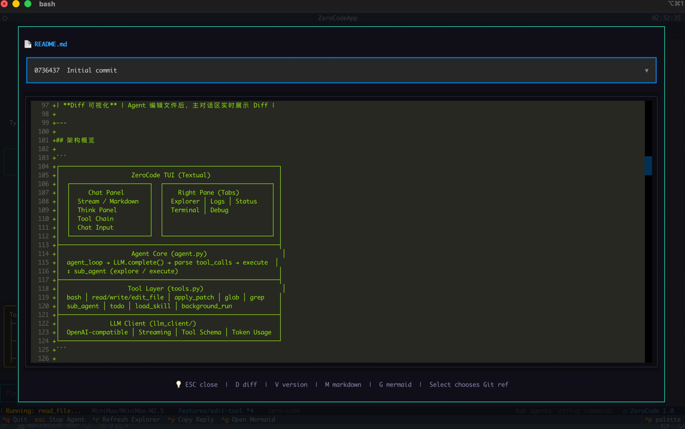
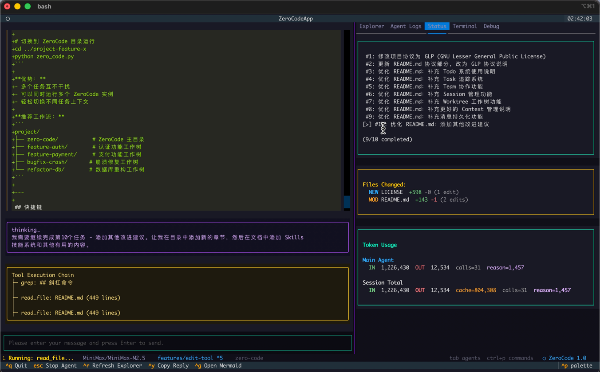

<div align="center">

```
███████╗███████╗██████╗  ██████╗         ██████╗ ██████╗ ██████╗ ███████╗
╚══███╔╝██╔════╝██╔══██╗██╔═══██╗       ██╔════╝██╔═══██╗██╔══██╗██╔════╝
  ███╔╝ █████╗  ██████╔╝██║   ██║█████╗ ██║     ██║   ██║██║  ██║█████╗  
 ███╔╝  ██╔══╝  ██╔══██╗██║   ██║╚════╝ ██║     ██║   ██║██║  ██║██╔══╝  
███████╗███████╗██║  ██║╚██████╔╝       ╚██████╗╚██████╔╝██████╔╝███████╗
╚══════╝╚══════╝╚═╝  ╚═╝ ╚═════╝         ╚═════╝ ╚═════╝ ╚═════╝ ╚══════╝
```

**终端里的 AI 编程 Agent**

OpenAI 兼容 API · Cyberpunk TUI · 工具调用 · 子 Agent · 上下文自动压缩 · 技能扩展

</div>

---

## 效果展示

<!-- TODO: 替换为实际截图 -->

| 主界面 |
|--------|
|  |

| 文件浏览器 & Git Diff |
|----------------------|
|  |

| 状态                            |
|-------------------------------|
|  |

---

## 特性

- **Cyberpunk TUI** — 基于 [Textual](https://github.com/Textualize/textual)，紫/青/金霓虹配色
- **OpenAI 兼容** — DeepSeek、GLM、Kimi、MiniMax、OpenAI、Ollama 等开箱即用
- **流式输出** — 实时渲染回答，thinking 面板展示推理过程
- **13 内置工具** — bash、文件读写编辑、glob/grep、patch、后台任务等
- **子 Agent** — explore（只读）/ execute（读写）两种模式，自动拆分复杂任务
- **上下文压缩** — Token 超阈值自动压缩，工具输出自动 microcompact
- **Todo 追踪** — Agent 自动规划多步骤任务，右侧面板实时展示进度
- **技能系统** — 7 个内置技能（code-review / mermaid / pdf / pptx / web-search 等），支持自定义扩展
- **文件浏览器** — 目录树 + 文件查看 + Git 历史版本 & Diff
- **Mermaid 渲染** — 检测回答中的 Mermaid 图表，`Ctrl+G` 浏览器打开
- **内置终端** — 独立 bash 会话，无需离开 Agent
- **Diff 可视化** — 文件编辑实时展示 unified diff

---

## 快速开始

```bash
# 1. 克隆 & 安装
git clone https://github.com/your-org/zero-code.git && cd zero-code
python -m venv .venv && source .venv/bin/activate
pip install -r requirements.txt

# 2. 配置 API
cp .env.example .env
# 编辑 .env 填写 OPENAI_COMPAT_MODEL / OPENAI_COMPAT_BASE_URL / OPENAI_COMPAT_API_KEY

# 3. 启动
python zero_code.py
```

---

## 使用教程

### 基本操作

- **发送消息**：底部输入框输入，`Enter` 发送
- **换行**：`Shift+Enter` 或 `Ctrl+J`
- **中断 Agent**：`ESC`

### 典型场景

```
# 写代码 — Agent 会读文件 → 制定计划 → 编辑 → 测试验证
请帮我创建一个 retry 装饰器，支持指数退避

# 调试 — 自动运行测试、分析错误、修复、重新验证
运行 pytest tests/ 然后修复所有失败的测试

# 代码探索 — glob/grep/read_file 扫描后生成分析
分析这个项目的架构，画一个流程图

# 重构
把 utils.py 中的函数按功能拆分到 utils/ 目录下的独立模块

# Code Review
Review src/api/ 下所有接口，检查安全和性能隐患
```

### 右侧面板

| Tab | 说明 |
|-----|------|
| **Explorer** | 文件树，点击查看文件（`D` Diff / `V` 历史版本 / `M` Markdown 渲染） |
| **Agent Logs** | 工具调用详细日志 |
| **Status** | Todo 列表 · 文件变更统计 · Token 用量 |
| **Terminal** | 内置终端，独立 bash 会话 |
| **Debug** | 系统调试日志 |

---

## 内置工具

| 分类 | 工具 | 说明 |
|------|------|------|
| 文件 | `read_file` | 读取文件（带行号），支持 offset/limit，传目录则列内容 |
| | `write_file` | 写入文件，自动创建父目录 |
| | `edit_file` | 精确文本替换 old_text → new_text，支持 replace_all |
| | `apply_patch` | `@@` 上下文定位 + `+/-` 行变更，适合大范围修改 |
| 搜索 | `glob` | 按 glob 模式查找文件（按修改时间排序） |
| | `grep` | 正则搜索（优先 ripgrep，回退 Python re） |
| 执行 | `bash` | 持久 bash 会话，cwd/env 跨轮次保持 |
| | `background_run` | 后台异步执行 |
| | `check_background` | 查看后台任务状态 |
| Agent | `sub_agent` | 委托子 Agent（explore 只读 / execute 读写） |
| | `todo` | 管理任务列表 |
| | `load_skill` | 加载技能文件 |

---

## 技能系统

内置 7 个技能：`code-review` · `mcp-builder` · `mermaid` · `pdf` · `pptx` · `visual-explainer` · `web-search`

```bash
/skills          # 查看已加载技能
```

Agent 通过 `load_skill(name)` 工具加载技能。默认技能目录为 `<agent_home>/.skills`，可通过 `ZERO_CODE_SKILLS_DIR` 配置；若未配置或配置目录不存在，会自动回退到 `<agent_home>/.skills`。技能文件格式为 `<skills_dir>/<name>/SKILL.md`，使用 YAML frontmatter 定义元数据。

<details>
<summary>创建自定义技能</summary>

```text
<skills_dir>/my-skill/SKILL.md
```

````markdown
---
name: my-skill
description: 技能描述
tags: python, utils
---

# 技能内容

Agent 通过 load_skill("my-skill") 加载后会获得这些知识。
````

</details>

---

## 上下文管理

- **自动压缩**：Token 超过阈值（默认 50,000）自动压缩对话，保留关键信息 + Todo 状态 + 最近文件列表
- **Microcompact**：早期工具输出自动存档到 `.cache/`，仅保留摘要引用
- **手动压缩**：`/compact [focus]`，可指定聚焦主题
- **Transcript 存档**：每次压缩自动保存完整对话到 `.cache/transcript_*.jsonl`
- **Token 查看**：`/context` 或右侧 Status 面板

---

## 命令 & 快捷键

**斜杠命令：**

| 命令 | 说明 |
|------|------|
| `/help` | 可用命令列表 |
| `/compact [focus]` | 压缩上下文 |
| `/context` | Token 用量统计 |
| `/skills` | 已加载技能 |
| `q` / `exit` | 退出 |

**快捷键：**

| 键 | 功能 |
|----|------|
| `ESC` | 停止 Agent |
| `Ctrl+Q` | 退出 |
| `Ctrl+Y` | 复制最近回复 |
| `Ctrl+G` | 浏览器打开 Mermaid 图表 |
| `Ctrl+R` / `F5` | 刷新文件树 |

**文件查看器：** `D` Diff · `V` 历史版本 · `M` Markdown · `G` Mermaid · `ESC` 关闭

---

## 配置

所有配置通过 `.env` 设置：

| 变量 | 默认值 | 说明 |
|------|--------|------|
| `OPENAI_COMPAT_MODEL` | *必填* | 模型 ID |
| `OPENAI_COMPAT_BASE_URL` | *必填* | API 地址 |
| `OPENAI_COMPAT_API_KEY` | *必填* | API Key |
| `OPENAI_COMPAT_SUPPORTS_IMAGE_INPUT` | 空 | 强制覆盖图片输入能力，`1/true` 开启，`0/false` 关闭 |
| `OPENAI_COMPAT_SUPPORTS_PDF_INPUT_CHAT` | 空 | 强制覆盖 chat 路径下的 PDF 原生输入能力 |
| `OPENAI_COMPAT_SUPPORTS_PDF_INPUT_RESPONSES` | 空 | 强制覆盖 responses 路径下的 PDF 原生输入能力 |
| `OPENAI_COMPAT_SUPPORTS_DATA_URL` | 空 | 强制覆盖 data URL 图片传输能力 |
| `DASHSCOPE_API_KEY` | 空 | DashScope API Key。配置后可启用 `generate_image` 工具 |
| `DASHSCOPE_IMAGE_MODEL` | 空 | Qwen-image 模型名，例如 `qwen-image-2.0-pro`。未配置则不注册 `generate_image` 工具 |
| `DASHSCOPE_IMAGE_BASE_URL` | `https://dashscope.aliyuncs.com/api/v1` | DashScope 图像生成 API base URL |
| `DASHSCOPE_IMAGE_DEFAULT_SIZE` | 空 | `generate_image` 默认尺寸，例如 `1024*1024` |
| `DASHSCOPE_IMAGE_OUTPUT_DIR` | `outputs/generated-images` | 生成图片的默认保存目录 |
| `DASHSCOPE_IMAGE_PROMPT_EXTEND` | `true` | 是否默认开启 prompt 智能改写 |
| `DASHSCOPE_IMAGE_WATERMARK` | `false` | 是否默认添加水印 |
| `DASHSCOPE_IMAGE_USE_PROXY` | `false` | 是否为图像生成请求显式启用系统/环境代理。默认关闭，避免 macOS 系统代理或本地代理软件劫持 HTTPS 导致证书错误 |
| `DASHSCOPE_IMAGE_EDIT_MODEL` | 空 | Qwen-image 图像编辑模型名，例如 `qwen-image-2.0-pro`。未配置则不注册 `edit_image` 工具 |
| `DASHSCOPE_IMAGE_EDIT_BASE_URL` | `https://dashscope.aliyuncs.com/api/v1` | DashScope 图像编辑 API base URL |
| `DASHSCOPE_IMAGE_EDIT_DEFAULT_SIZE` | 空 | `edit_image` 默认输出尺寸，例如 `1024*1536` |
| `DASHSCOPE_IMAGE_EDIT_OUTPUT_DIR` | `outputs/edited-images` | 编辑后图片的默认保存目录 |
| `DASHSCOPE_IMAGE_EDIT_PROMPT_EXTEND` | `true` | 是否默认开启图像编辑 prompt 智能改写 |
| `DASHSCOPE_IMAGE_EDIT_WATERMARK` | `false` | 是否默认添加水印 |
| `DASHSCOPE_IMAGE_EDIT_USE_PROXY` | `false` | 是否为图像编辑请求显式启用系统/环境代理。默认关闭，避免本地代理导致证书校验失败 |
| `CONTEXT_COMPACT_THRESHOLD` | `50000` | 自动压缩阈值（token） |
| `ZERO_CODE_SKILLS_DIR` | `<agent_home>/.skills` | 自定义技能目录（相对路径按 agent_home 解析）。未配置或目录不存在时自动回退默认值 |
| `STREAM_FLUSH_MIN_INTERVAL_S` | `0.08` | 流式刷新最小间隔（秒） |
| `STREAM_FLUSH_MIN_CHARS` | `24` | 缓冲区刷新字符数 |
| `THINK_PANEL_HIDE_DELAY_S` | `1.8` | 思考面板消失延迟 |
| `TOOL_PANEL_HIDE_DELAY_S` | `2.2` | 工具链面板消失延迟 |

`generate_image` 和 `edit_image` 工具对 agent 返回的是精简 JSON，而不是完整 provider 响应。成功时默认包含 `ok`、`image_count`、`primary_path`、`paths`、`request_id`、`provider`、`model`；其中 `edit_image` 额外包含 `input_paths`。失败时返回 `ok: false` 和结构化 `error` 对象，当前会区分 `configuration_error`、`invalid_input`、`input_not_found`、`input_type_error`、`input_count_error`、`network_error`、`provider_http_error`、`provider_server_error`、`download_network_error`、`download_http_error`、`download_server_error`、`empty_result` 等类别。底层 provider 原始响应仍保留在 Python 返回值中，便于后续调试或扩展，但不会直接注入工具结果上下文。

当 `generate_image` 或 `edit_image` 成功产出本地图片后，TUI 会提示可按 `Ctrl+O` 用系统默认浏览器打开最近一次结果图片；如果一次返回多张图片，会依次打开这些本地文件。

图像生成/编辑链路默认不会继承系统代理或环境代理，而是直接连接 DashScope，并使用 `certifi` 的 CA 包做 HTTPS 校验。这是为了避免 macOS 系统代理、V2Ray/Clash 等本地代理软件被 `urllib` 自动继承后触发 `CERTIFICATE_VERIFY_FAILED`。如果你确实需要通过代理访问，再显式设置 `DASHSCOPE_IMAGE_USE_PROXY=true` 或 `DASHSCOPE_IMAGE_EDIT_USE_PROXY=true`。

---

## 项目结构

```
zero-code/
├── zero_code.py            # 入口
├── core/
│   ├── agent.py            # Agent 主循环 & 子 Agent
│   ├── commands.py         # 斜杠命令
│   ├── runtime.py          # 运行时配置（模型、路径、LLM client）
│   ├── state.py            # 状态管理（Context、Todo、Skill、TUI 适配）
│   ├── tools.py            # 内置工具实现 & Schema
│   └── tui.py              # Textual TUI 界面
├── llm_client/
│   ├── interface.py        # 请求/响应数据结构 & Protocol
│   ├── llm_factory.py      # OpenAI 兼容客户端（流式 & 非流式）
│   ├── llm_tooling.py      # 工具注册 & Schema 生成
│   └── llm_utils.py        # JSON 提取等工具函数
├── .skills/                # 默认技能目录（可通过 ZERO_CODE_SKILLS_DIR 覆盖）
├── docs/                   # 设计文档
└── tests/                  # 测试
```

---

## Roadmap

### Done

- [x] Cyberpunk TUI（对话、流式输出、thinking 面板、工具链可视化）
- [x] 13 内置工具（bash / 文件操作 / 搜索 / patch / 后台任务）
- [x] 子 Agent 委托（explore / execute）
- [x] Todo 任务追踪
- [x] 上下文自动压缩 & Microcompact & Transcript 存档
- [x] 技能系统（7 内置 + 自定义扩展）
- [x] 文件浏览器 + Git Diff / History
- [x] Mermaid 图表浏览器渲染
- [x] 内置终端

### Next

- [ ] **Task 机制** — 结构化任务定义，支持依赖关系、优先级、超时、重试
- [ ] **Teammate 协作** — 多 Agent 角色分工（Architect / Coder / Reviewer / Tester），Agent 间通信协调
- [ ] **Session 持久化** — 会话保存/恢复，跨重启保持完整对话上下文和任务状态
- [ ] **消息持久化** — 完整聊天记录持久存储，支持历史搜索和回溯
- [ ] **Worktree 集成** — Git Worktree 原生支持，一键创建隔离环境，任务独立分支
- [ ] **分层 Context** — 全局 / 项目 / 任务三级上下文，选择性遗忘，重要信息钉选
- [ ] **AGENTS.md** — 项目级 Agent 配置，自定义 system prompt / 工具权限 / 行为约束
- [ ] **MCP 协议** — 接入 Model Context Protocol，扩展外部工具和数据源
- [ ] **Web UI** — 浏览器端访问，支持远程协作
- [ ] **多模型路由** — 不同任务自动选择最优模型（推理 vs 快速 vs 低成本）
- [ ] **成本追踪** — 按任务/会话统计 Token 消耗和 API 成本

---

## FAQ

**支持哪些模型？** — 任何 OpenAI 兼容 API：DeepSeek、GLM、Kimi、MiniMax、OpenAI、Ollama / vLLM 等。

**API Key 安全吗？** — 仅存本地 `.env`，已在 `.gitignore` 中。

**Agent 能改我的文件吗？** — 可以。所有变更在 Status 面板和对话区可见。建议在 Git 仓库中使用。

**对话太长怎么办？** — `/compact` 手动压缩，或等自动压缩（默认 50K token 阈值）。`/context` 查看用量。

**怎么停止 Agent？** — `ESC` 中断，Agent 会安全清理状态。

---

## License

[LGPL-3.0](LICENSE)

<div align="center">
<sub>Built with Python · Powered by Textual & OpenAI-compatible LLMs</sub>
</div>
