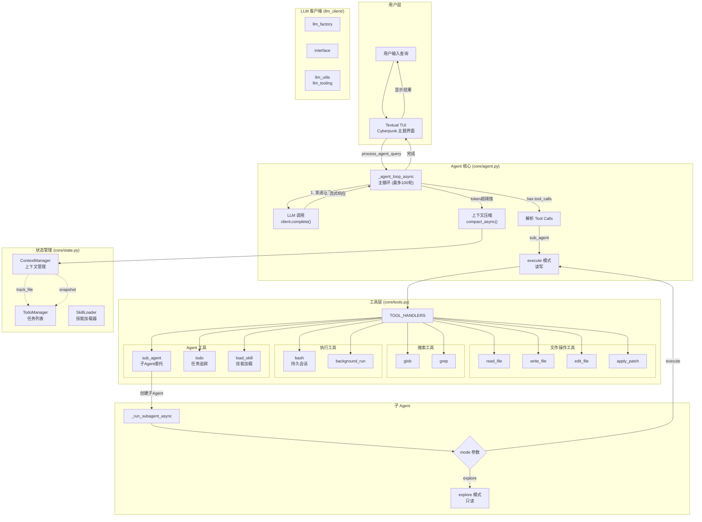
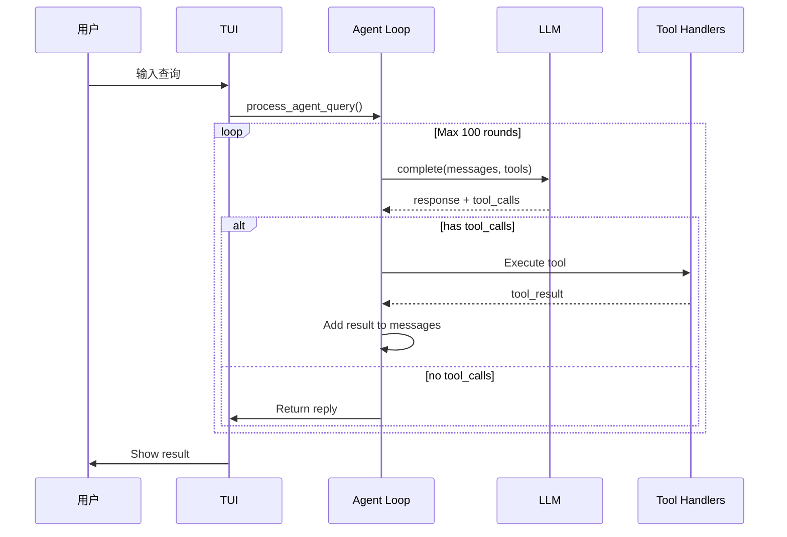
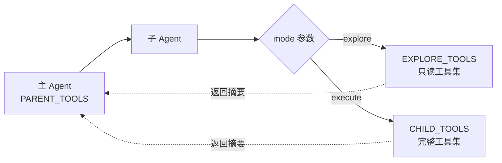

# ZeroCode Agent 核心流程分析

## 项目概述

ZeroCode 是一个交互式 CLI 编程 Agent，基于 Textual TUI 构建，支持工具调用、子 Agent 委托、任务追踪和上下文压缩等特性。

### 核心特性

| 特性 | 说明 |
|------|------|
| **工具调用** | 支持 10+ 内置工具，涵盖文件操作、搜索、执行等 |
| **子 Agent** | 支持 explore（只读）和 execute（读写）两种模式 |
| **任务追踪** | 内置 TodoManager，支持多任务状态管理 |
| **上下文压缩** | 自动压缩超长对话，保持 token 在内 |
| **阈值持久会话** | bash 命令保持会话状态，跨轮次持久 |
| **技能系统** | 支持加载外部技能扩展功能 |
| **TUI 界面** | Cyberpunk 主题，实时显示 Agent 思考过程 |

### 技术栈

- **UI 框架**: Textual (Python TUI 库)
- **LLM 调用**: OpenAI 兼容接口 (openai-python)
- **状态管理**: 自研 ContextManager、TodoManager
- **工具系统**: 自研 TOOL_HANDLERS 框架

## 核心架构图



## 详细流程说明

### 1. 用户输入流程
```
用户输入 → ChatInput.Submitted → process_agent_query() → agent_loop()
```

### 2. 主 Agent 循环 (_agent_loop_async)



### 3. 工具执行流程

#### 3.1 工具列表

| 工具名 | 描述 | 核心函数 |
|--------|------|----------|
| `bash` | 持久 bash 会话 | `BashSession.execute()` |
| `read_file` | 读取文件 | `run_read()` |
| `write_file` | 写入文件 | `run_write()` |
| `edit_file` | 编辑文件 | `run_edit()` (支持模糊匹配) |
| `apply_patch` | 应用补丁 | `run_apply_patch()` |
| `glob` | 文件搜索 | `run_glob()` |
| `grep` | 内容搜索 | `run_grep()` |
| `sub_agent` | 子 Agent | `_run_subagent_async()` |
| `todo` | 任务管理 | `TodoManager.update()` |
| `load_skill` | 加载技能 | `SkillLoader.get_content()` |

#### 3.2 工具参数详解

**bash**
- `command`: 要执行的 shell 命令
- `restart`: (可选) 是否重启 bash 会话，默认为 false

**read_file**
- `path`: 文件路径
- `limit`: (可选) 最大返回行数
- `offset`: (可选) 起始行号 (1-indexed)

**write_file**
- `path`: 目标文件路径 (会自动创建父目录)
- `content`: 文件内容
- 注意: 仅用于新建文件，编辑现有文件用 edit_file 或 apply_patch

**edit_file**
- `path`: 文件路径
- `old_text`: 要替换的文本 (必须唯一，除非 replace_all=true)
- `new_text`: 替换后的文本
- `replace_all`: (可选) 是否替换所有匹配项，默认 false

**apply_patch**
- `path`: 文件路径
- `patch`: 补丁内容，使用 `@@ 上下文行` 格式定位
  - `@@ context_line` - 定位行
  - `-old_line` - 删除的行
  - `+new_line` - 新增的行

**glob**
- `pattern`: glob 模式 (如 `*.py`, `**/*.ts`)
- `path`: (可选) 搜索目录，默认为工作目录

**grep**
- `pattern`: 正则表达式
- `path`: (可选) 搜索路径
- `include`: (可选) 文件名过滤 (如 `*.py`)
- `max_results`: (可选) 最大返回结果数，默认 50

**sub_agent**
- `prompt`: 子 Agent 的任务描述
- `mode`: 执行模式
  - `explore`: 只读模式，仅允许使用 glob, grep, read_file
  - `execute`: 读写模式，允许使用全部工具
- `description`: (可选) 日志标签

**todo**
- `items`: 任务列表数组
- 每个任务包含:
  - `id`: 任务唯一标识
  - `text`: 任务描述
  - `status`: 状态 (`pending`/`in_progress`/`completed`)

**load_skill**
- `name`: 技能名称
- 技能定义默认存储在 `<agent_home>/.skills/`，可通过 `ZERO_CODE_SKILLS_DIR` 覆盖；若配置目录不存在则回退默认目录

### 4. 上下文管理 (ContextManager)

- **Microcompact**: 单轮内压缩过长的工具输出（保留最后10个）
- **Auto-compact**: 当输入 token 超过阈值(50000)时自动压缩
- **压缩流程**: 
  1. 保存原始 transcript 到 `.cache/`
  2. 调用 LLM 生成摘要
  3. 重构消息，保留摘要 + todo 状态 + 最近文件

### 5. 子 Agent 机制



### 6. 状态追踪

- **TodoManager**: 维护任务列表，支持 `pending/in_progress/completed` 状态
- **SkillLoader**: 从配置的 skills 目录加载技能定义（默认 `<agent_home>/.skills/`）
- **ContextManager**: 追踪 token 使用、文件访问、子 Agent 记录

## 关键文件

| 文件 | 职责 |
|------|------|
| `core/agent.py` | Agent 主循环、LLM 调用、子 Agent 调度 |
| `core/tui.py` | Textual UI 实现、用户交互、结果显示 |
| `core/tools.py` | 工具定义、工具执行器 |
| `core/state.py` | 上下文管理、Todo、Skills |
| `core/runtime.py` | LLM 客户端初始化、路径配置 |
| `llm_client/` | LLM 调用封装 |

## 配置

### 目录配置

| 变量 | 说明 | 默认值 |
|------|------|--------|
| `WORKDIR` | 工作目录 | 当前 cwd |
| `AGENT_DIR` | Agent 根目录 | zero-code 项目根目录 |
| `.skills/` | 默认技能定义目录 | 默认在 `<agent_home>/.skills`，可通过 `ZERO_CODE_SKILLS_DIR` 覆盖 |
| `.cache/` | 缓存目录 | 项目根目录下的 .cache 目录 |

### LLM 客户端配置

通过环境变量配置兼容 OpenAI 的 LLM 客户端:

| 环境变量 | 说明 | 示例 |
|----------|------|------|
| `OPENAI_COMPAT_BASE_URL` | API 基础 URL | `https://api.openai.com/v1` |
| `OPENAI_COMPAT_API_KEY` | API 密钥 | `sk-xxx` |
| `OPENAI_COMPAT_MODEL` | 模型名称 | `gpt-4o`, `claude-3-opus` |
| `OPENAI_COMPAT_MAX_TOKENS` | 最大生成 token 数 | `4096` |
| `OPENAI_COMPAT_TEMPERATURE` | 生成温度 | `0.7` |
| `OPENAI_COMPAT_TIMEOUT` | 请求超时时间(秒) | `120` |

#### 支持的模型类型

项目通过 `llm_client/` 目录支持多种 LLM 提供商:
- **OpenAI**: GPT-4, GPT-4 Turbo, GPT-3.5 Turbo
- **Claude**: Claude 3 Opus, Claude 3 Sonnet (通过 OpenAI 兼容接口)
- **Gemini**: Google Gemini Pro (通过 OpenAI 兼容接口)
- **自定义**: 任何兼容 OpenAI ChatCompletions API 的服务

#### LLM 客户端架构

```
llm_client/
├── __init__.py          # 客户端初始化
├── factory.py           # LLM 工厂函数
├── interface.py         # 统一接口定义
├── llm_utils.py         # 工具函数
└── llm_tooling.py       # 工具调用相关
```

- **llm_factory**: 根据配置创建对应的 LLM 客户端实例
- **interface**: 定义统一的 `complete()` 方法接口
- **llm_tooling**: 处理工具调用格式转换

## TUI 界面说明

### 界面架构

ZeroCode 使用 Textual 框架构建终端用户界面，采用 Cyberpunk 赛博朋克主题。

```
┌─────────────────────────────────────────────────────────┐
│  ZeroCode Agent                              [?] Help  │
├─────────────────────────────────────────────────────────┤
│                                                         │
│  ┌─────────────────────────────────────────────────┐   │
│  │                  对话区域                         │   │
│  │  用户:帮我查看一下 core 目录下的文件               │   │
│  │                                                 │   │
│  │  Agent: 正在分析 core 目录...                    │   │
│  │                                                 │   │
│  │  [tool] glob: pattern="*.py", path="core"      │   │
│  │  Result:                                         │   │
│  │  - core/agent.py                                 │   │
│  │  - core/tools.py                                 │   │
│  │  - core/tui.py                                   │   │
│  │  - core/state.py                                 │   │
│  └─────────────────────────────────────────────────┘   │
│                                                         │
│  ┌─────────────────────────────────────────────────┐   │
│  │  > 输入消息...                                   │   │
│  └─────────────────────────────────────────────────┘   │
│                                                         │
├─────────────────────────────────────────────────────────┤
│  Tasks: 2 pending | Tokens: 12.5K | Round: 5/100       │
└─────────────────────────────────────────────────────────┘
```

### 核心组件

| 组件 | 文件 | 说明 |
|------|------|------|
| `ZeroCodeApp` | `core/tui.py` | 主应用类，继承 `TApp` |
| `ChatView` | `core/tui.py` | 对话显示区域 |
| `ChatInput` | `core/tui.py` | 用户输入框 |
| `StatusBar` | `core/tui.py` | 底部状态栏 |

### 交互流程

1. 用户在输入框输入查询
2. 按 `Enter` 提交
3. 消息发送到 Agent 循环
4. Agent 响应实时显示在对话区域
5. 工具调用以特殊样式高亮显示

### 快捷键

| 快捷键 | 功能 |
|--------|------|
| `Enter` | 发送消息 |
| `Ctrl+C` | 取消当前操作 |
| `Ctrl+L` | 清屏 |
| `Ctrl+Q` | 退出 |

### 主题定制

Cyberpunk 主题主要颜色配置:
- **主色**: `#00ff9f` (霓虹绿)
- **次色**: `#ff0055` (霓虹粉)
- **背景**: `#0d0d0d` (深黑)
- **文字**: `#e0e0e0` (浅灰)

## 错误处理与调试

### 常见错误类型

| 错误类型 | 原因 | 处理方式 |
|----------|------|----------|
| `LLMConnectionError` | API 连接失败 | 检查网络和 API Key 配置 |
| `AuthenticationError` | API 认证失败 | 验证 `OPENAI_COMPAT_API_KEY` |
| `RateLimitError` | 请求频率超限 | 等待后重试或降低并发 |
| `TokenLimitError` | 上下文超长 | 触发自动压缩或手动清理 |
| `ToolExecutionError` | 工具执行失败 | 检查命令路径和权限 |
| `FileNotFoundError` | 文件不存在 | 检查文件路径是否正确 |

### 调试模式

启用调试模式查看详细日志:

```bash
# 设置环境变量
export TEXTUAL_LOG=debug
export OPENAI_COMPAT_DEBUG=1

# 运行 Agent
python -m core.tui
```

### 日志输出

- **日志级别**: `DEBUG`, `INFO`, `WARNING`, `ERROR`
- **日志位置**: 终端输出 + 可选文件输出
- **关键日志点**:
  - LLM 请求/响应
  - 工具调用参数和结果
  - 上下文压缩详情
  - Token 计数

### 缓存机制

- **对话缓存**: `.cache/` 目录下存储压缩前的对话
- **技能缓存**: 技能定义会被缓存以提高加载速度
- **清理缓存**: 删除 `.cache/` 目录内容可强制重新加载

### 性能优化

1. **减少上下文**: 及时使用 `todo` 标记完成任务
2. **合理使用子 Agent**: 复杂任务拆分子 Agent
3. **压缩触发**: 关注 Token 计数，接近 50000 时考虑手动压缩
4. **工具选择**: 优先使用 `grep`/`glob` 定位，减少 `read_file` 次数
